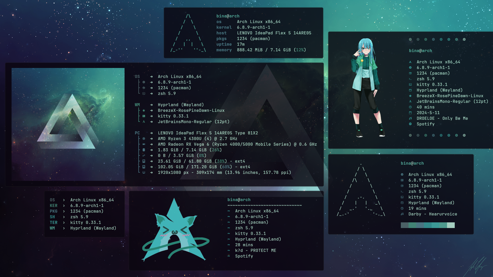

# Fastfetch 

<h3 align="left">
Welcome to my fastfetch config presets repo :3
</h3>

[Fastfetch](https://github.com/fastfetch-cli/fastfetch) is a tool for fetching system information and displaying them in a pretty way. 
In this repo, I collect my config files that I designed for my [Arch Linux](https://archlinux.org/) [Hyprland](https://github.com/hyprwm/Hyprland) rice. 
Feel free to copy files and modify them or clone the complete repository.

<p align="center">
  
</p>

## Usage

Clone the repository into ``~/.local/share``

```sh
cd ~/.local/share
git clone https://github.com/LierB/fastfetch
```
and execute your preferred files (e.g. ``groups.jsonc`` or ``minimal.jsonc``) with 

```sh
fastfetch --config groups
fastfetch --config minimal
```
OR

Copy your preferred config file (if necessary images/ascii-art files), rename it to ``config.jsonc``, move it to ``~/.config/fastfetch`` and execute it with 

```sh
fastfetch
# or with additional options e.g.
fastfetch --colors-block-range-start 9 --colors-block-width 3
```
